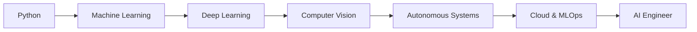

<p align="center">
  
</p>
<div align="center">

[](https://www.linkedin.com/in/rajath-mohare-a1487b275)

[](mailto:moharerajath@gmail.com) 

</div>


<p align="center">

</p>

</div>

---

# 🛰 AI COMMAND CENTER

```yaml
NAME: Rajath Mohare

ROLE: AI/ML Engineer

STATUS: ONLINE

EDUCATION:
  B.E Computer Science & Engineering (AI & ML)
##  STATUS

```text
██████████████████████  Python               90%

████████████████████░░  Machine Learning     85%

██████████████████░░░░  Computer Vision      80%

████████████████░░░░░░  Deep Learning        75%

██████████████░░░░░░░░  Cloud Computing      70%

████████████░░░░░░░░░░  DSA                  Training...
```


MISSION:
  Build intelligent systems that solve real-world problems.
```

---

# ⚙ SYSTEM INITIALIZATION

```python
class RajathMohare:

    role = "AI/ML Engineer"

    languages = [
        "Python",
        "Java",
        "C++"
    ]

    domains = [
        "Machine Learning",
        "Computer Vision",
        "Deep Learning",
        "Autonomous Driving"
    ]

    current_goal = "Become a Product-Based AI Engineer"

    status = "Building. Learning. Improving."
```

---

# 🚀 FEATURED PROJECTS

## 🚗 Secure Multi-Agent V2V Communication Framework

```diff
+ MetaDrive Simulation
+ AES Encryption
+ UDP Communication
+ Hybrid A* Path Planning
+ Intelligent Driver Model (IDM)
+ Multi-Agent Autonomous Driving
```

---

## 🛒 AI Powered Smart Shopping Basket

```diff
+ YOLO Object Detection
+ OpenCV
+ Automated Billing
+ QR Payment System
+ Retail Automation
```

---

## 🎥 AI Based Proctoring System

```diff
+ Face Monitoring
+ Activity Detection
+ Online Exam Security
+ Automated Deployment
```

---


# 🧠 TECH STACK

### Programming Languages

<p>

</p>

### AI / Machine Learning

<p>

</p>

### Tools & Platforms

<p>

</p>

### Libraries

```text
OpenCV
NumPy
Pandas
Scikit-Learn
TensorFlow
Matplotlib
```

---

# 📊 GITHUB ANALYTICS

<div align="center">


</div>

---

# 🔥 CONTRIBUTION STREAK

<div align="center">


</div>

---

# 🏆 ACHIEVEMENT WALL

* 🎓 Final Year AI & ML Engineering Student
* 🚗 Developed Autonomous Driving Simulation
* 🤖 Built Multiple AI Applications
* 📱 Android Development Internship
* ☁️ Exploring Cloud & MLOps
* 🚀 Future AI Product Builder

---

# 📡 AI SKILL MATRIX

```text
PYTHON              ████████████████████ 90%

MACHINE LEARNING    ██████████████████░░ 85%

COMPUTER VISION     ████████████████░░░░ 80%

DEEP LEARNING       ███████████████░░░░░ 75%

CLOUD COMPUTING     ██████████████░░░░░░ 70%

DSA                 ███████████░░░░░░░░░ Improving...
```

---

# 🧠 LEARNING ROADMAP



---

# 🐍 CONTRIBUTION SNAKE

<p align="center">

</p>

---

# 🌐 CONNECT WITH ME

<p align="center">

<a href="https://github.com/rajath17">
GitHub
</a>

|

<a href="https://linkedin.com">
LinkedIn
</a>

</p>

---

<div align="center">

# 🚀 TRAIN • BUILD • DEPLOY • REPEAT

### Building Intelligent Systems for the Future

</div>
